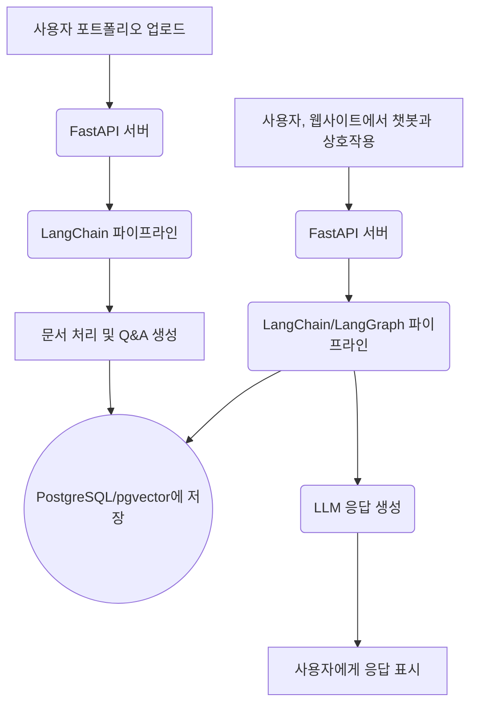

# lio

lio는 사용자의 포트폴리오(PDF 또는 TXT)를 입력받아 내용을 기반으로 예상 Q&A를 자동으로 생성하고 구조화하는 서비스입니다. 분석된 콘텐츠는 RAG(Retrieval-Augmented Generation) 기반 챗봇이 탑재된 포트폴리오 웹사이트를 통해 제공되어, 사용자와의 상호작용을 지원합니다.

### 주요 기능

- **포트폴리오 분석:** 비정형 포트폴리오 문서(PDF, TXT)를 수집하고 분석합니다.
- **자동 Q&A 생성:** 포트폴리오 콘텐츠를 기반으로 관련 질문과 답변 쌍을 지능적으로 생성합니다.
- **RAG 기반 챗봇:** 검색 증강 생성(RAG) 기술을 활용하여 포트폴리오에 대한 질문에 답변하는 대화형 챗봇을 제공합니다.
- **웹 포트폴리오 제공:** 분석된 콘텐츠와 챗봇을 깔끔하고 접근성 높은 웹 인터페이스를 통해 제공합니다.

### 기술 스택

- **Backend:** Python, FastAPI
- **AI/LLM:** LangChain, LangGraph
- **Database & Vector Store:** PostgreSQL, pgvector
- **Caching & Messaging:** Redis
- **Notifications:** FCM (Firebase Cloud Messaging)

### 🏛️ 시스템 아키텍처



### 🏗️ 프로젝트 구조

```
/app
├── api/        # API 라우터 및 엔드포인트 정의
├── core/       # 프로젝트 설정(환경 변수 등)
├── crud/       # 데이터베이스 CRUD(생성, 읽기, 업데이트, 삭제) 연산
├── db/         # 데이터베이스 세션 및 초기화
├── models/     # SQLAlchemy 데이터베이스 모델
├── schemas/    # Pydantic 데이터 검증 스키마
└── services/   # 핵심 비즈니스 로직
```

### 🚀 CI/CD 파이프라인

- **GitHub Actions**를 사용하여 CI/CD 파이프라인을 구축했습니다.
- `main` 브랜치에 코드가 푸시되면, `.github/workflows/deploy_dev.yml` 워크플로우가 자동으로 실행됩니다.
- 이 파이프라인은 Docker 이미지 빌드 및 개발 환경으로의 자동 배포를 수행하여 안정적이고 일관된 배포 프로세스를 보장합니다.